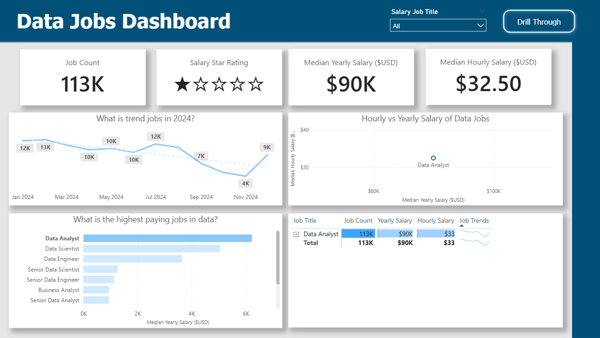

# 📊 DataJobs-PowerBI-Project

## **Objective**

This project was inspired by the YouTube channel **Luke Barousse** through his tutorial *“Power BI for Data Analytics.”*  
I followed his workflow to explore various Power BI tools and then modified the dashboard to suit my own analytical goals.  

Overall, this project demonstrates my applied proficiency in Power BI—specifically in data cleaning, visualization, KPI creation, and interactive reporting—showing that I can effectively transform raw data into meaningful insights.

---

## Dataset Used

I used the dataset and resources provided in the tutorial.  
**Video Reference:** [Power BI for Data Analytics](https://youtu.be/FwjaHCVNBWA?si=p-Bxy-R03MeAvIqK)

---

### Step 1: Data Cleaning, Filtering, and Formatting

After importing the CSV file, I performed the following:

- Adjusted data types (text, number, date) to ensure accuracy.
- Formatted salary and date columns for cleaner analysis.
- Filtered job titles containing **“Data”** to focus only on data-related roles (e.g., Data Analyst, Data Engineer, Data Scientist).  
  This helped narrow down the scope and create clearer visualizations.

### Step 2: Creating Tables, Visuals, and KPIs

#### Cards (KPIs) 
- Total Job Count  
- Salary Star Rating  
- Median Yearly Salary  
- Median Hourly Salary  

#### Line Chart 
Displays the number of data-related job postings from January to November 2024. This identifies which months had the highest demand for data professionals.

#### Scatter Plot: Hourly vs. Yearly Salary  
Shows the relationship between hourly and yearly pay.  

This helps determine:
- If hourly rates correlate with yearly salary  
- Which roles are consistently high-paying    

#### Bar Chart 
Highlights the **highest-paying data jobs** based on yearly salary.

#### Data Table 
A detailed breakdown of each job including title, salary, location, job type, and platform.

---

### Drill-Through Page Visuals

The drill-through page provides deeper insights for a selected job:

1. **Gauge Chart**  
   Shows how the selected job's median salary compares to the overall dataset.

2. **Donut Chart**  
   Summarizes the proportion of **Yes vs. No / True vs False** responses for a specific job attribute.

3. **Map Chart**  
   Shows which countries/regions offer the most data-related roles.

4. **Bar Chart**  
   Displays which job platforms list the most opportunities.

5. **Tree Map**  
   Breaks down job types (Full-Time, Part-Time, Contract).  
   In this dataset, Full-Time roles appear most frequently.

## Step 3: Dashboards, Slicers, and Drill-Through Navigation

I designed an interactive dashboard using:

- Slicers for filtering by job type
- Clear visual layout and consistent color themes  
- Drill-through navigation for deeper exploration   

This ensures users can explore and interpret insights easily.

## Sample Dashboard
This is what Page 1 looks like. To explore the drill-through page, You can access the full dashboard here: 

[Data Jobs Dashboard](https://youtu.be/FwjaHCVNBWA?si=p-Bxy-R03MeAvIqK)

